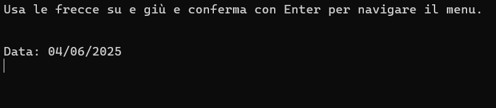
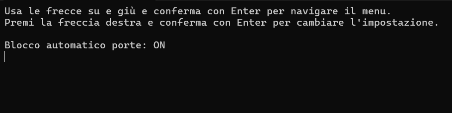
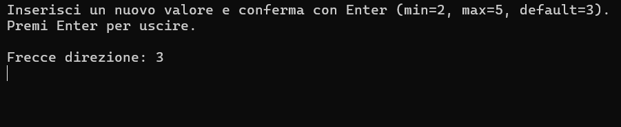

# Car Dashboard Menu - Assembly Project
This project is a simple car dashboard menu system implemented in C and Assembly. It simulates a car interface that allows the user to view and modify various settings depending on the access mode: **User** or **Supervisor**.

## 🚗 Features
- **User Mode** (run executable normally):
  - View:
    - Date
    - Time
    - Door Auto Lock (modifiable)
    - Back-Home Function (modifiable)
  - Navigation via:
    - Arrow Down / Arrow Up + Enter: navigate the menu
    - Arrow Right + Enter: open submenu
    - Enter: return to main menu

- **Supervisor Mode** (run with argument `2244`):
  - Access all User Mode options plus:
    - Highway Blinker Count (modifiable, range 2–5)
    - Tire Pressure Reset

## 🔧 How It Works

### Main Program (`main.c`)
- Initializes all main variables (`blocco`, `backhome`, `frecce`, `menuIndex`)
- Detects mode based on command-line arguments
- Uses `arrowKey()` to read special key inputs (arrow keys + enter)
- Displays menu based on `menuIndex` using `printf()` and `switch` statements
- Enters submenu on Arrow Right + Enter
- Submenu allows:
  - ON/OFF toggle for items 4 and 5 (via `on_off()` in Assembly)
  - Input for item 7 (`frecce_direzione()` in Assembly)
  - Reset message for item 8

### Input Handling (`arrowKey()`)
- Waits for keyboard input
- Detects arrow keys and returns a value indicating direction
- Handles Enter key as code `10`

### Assembly Functions

#### `on_off.s`
- Toggles ON/OFF strings in memory
- Compares and switches values using registers and ASCII strings

#### `frecce_direzione.s`
- Modifies highway blinker count
- Limits input values to [2, 5]
- Updates the value of the `frecce` variable directly

## 💡 Menu Navigation
Example menu (User Mode):
- Car Settings
- Date: 15/06/2014
- Time: 15:32
- Door Auto Lock: ON
- Back-home: ON

In Supervisor Mode:
- Car Settings
...
- Blinker Count: 3
- Reset Tire Pressure

## Notes
Submenus for date, time, and oil check are placeholders and not implemented by design.

The only settings that can be modified (via Assembly) are:
- Door Auto Lock (ON/OFF)
- Back-home (ON/OFF)
- Blinker Count (2 to 5)
- Tire Pressure Reset (prints message)

## 🧪 Build & Run
The project is already compiled and the executable can be found in source/bin. Run it with:
<pre>./main </pre>  

To compile the project, use the following commands:
<pre>make clean
make </pre>  

If you encounter missing 32-bit libraries, install them with:
<pre> sudo apt update
sudo apt install gcc-multilib g++-multilib </pre> 

## Screenshots

